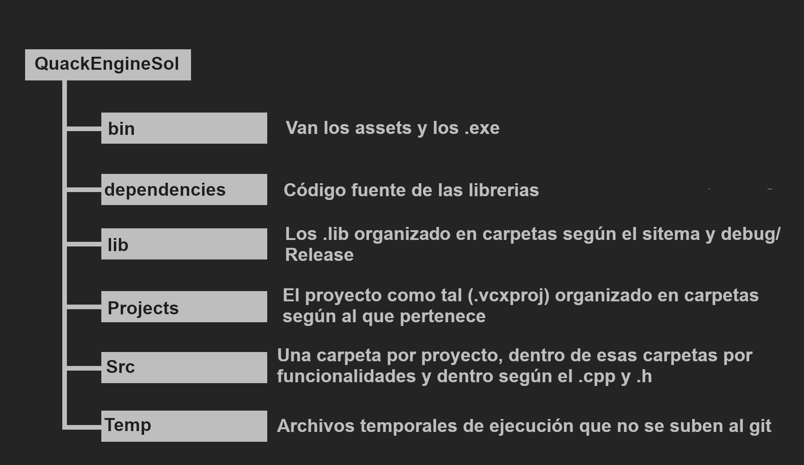

# Organicacón de archivos

QuackEngineSol es la solucion y en este repos solo habrá una sola solucion.  
Dentro de esta carpeta tenemops el bin (donde van todos los exe y donde deberian ir todos los assets. 
Despues tenemos dependencies que es donde irá el código fuente de cada libreria que nos instalemos  
En la caprta es Projects donde van todos los proyectos(física, sonido, ogre...) y el QuackEnginePro es el proyecto general del motor, y aquí es donde irá la lógica principal del motor, 
Src es donde va a ir todo el código fuente organizandolo en carpetas segun el proyecto, dentro de esa carpeta segun 
la funcionalidad (movimiento, render...), y dentro de la funcionalidad seguns si es .cpp o .h. Por último tenemos el Temp donde van todos los archivos temporales (la compilación) y no se sube al git así que chill. 
Aquí dejo un esquema para que quede mas claro.

## Para crear arvhivos nuevos:
A la hora de crear los archivos (.cpp y .h) no se crean desde visual por que los crea en donde le da la gana, hay que abrir el explorador de archivos, buscar en \Src la carpeta del proyecto al que pertenece, y dentro de esa carpeta navegar hasta donde tiene sentido que esté y crearlo alli a mano. Luego se pasa a visual y se le da a *click derecho en el proyecto*, *agregar, elemento existente* y se busca el que queremos.

## Para crear proyecos nuevos:

*clic derecho en la solución, agregar, nuevo proyecto*. Visual una vez mas lo crea donde le da la gana y lo tenemos que mover. Primero quitamos (no elimanr) el .cpp y lo movemos manualmente a la carpeta dentro de \Src que corresponda. Ahora quitamos el proyecto (que se ha creado en la carpeta \QuackEngineSol) y lo movemos a \QuackEngineSol\Projects\"nueva carpeta". Ya tenemos todo movido y podemos volver a visual y agregarlo de nuevo: /clic derecho en la solucion, agregar, proyecto existente, y buscamos el .vcxproj. Ahora solo falta agregar el .cpp que hemos quitado antes.

**IMPORTANTE:** se tiene que revisar que todas las rutas estén bien para que se situen automáticamente en las carpetas que queremos, para eso tenemos que ir a las propiedades del proyecto (*clic derecho en el proyecto y abajo del todo esta propiedades*). En general queremos que los proyectos que añadimos sean bibliotecas (excepto el proyecto principal de los dos juegos)  
Tenemos que asegurarnos de que estén estas opciones fijandose en que estemos en todas las configuraciones y en todas las plataformas: (si son bibliotecas)  
**Directorio de salida:** $(SolutionDir)lib\$(Platform)\$(Configuration)\  
**Directorio intermedio:** $(SolutionDir)Temp\$(ProjectName)\$(Platform)\$(Configuration)\  
**Nombre de destino:** $(ProjectName)  
**Tipo de configuración:** Biblioteca estática (.lib)  

  Dentro de este proyecto ya se meten todas las cosas de las librerias que nos hallamos descargado    

## MUY IMPORTANTE 
Al descargaros el repos ejecutarlo tal cual, os dirá: **ERROR: el fichero no se ha abierto** seguido de unos mensajes de debug para ver si el link ha funcionado. Para solucionar esto hay que volver a las propiedades del proyecto principal (QuackEnginePro), ir a la parte de depuración y en donde pone: **Directorio de trabajo** poner esto: $(SolutionDir)bin\  

Si os quereis asegurar de que todo funciona bien, hay que abrir la consola y ejecutar el .exe, tanto el .exe de la consola como visual pone que funciona pues está todo bien.

Las librerias a la hora de descargarlas tenemos que fijarnos en la version x86 (32 bits)  

## Juanma, esto sigue sin irme, ¿que coño hago?
Hay que compilar ogre amigo, acompañame en esta triste historia.  
Ahora empieza la fiesta de verdad. Se necesita cMake para compilar ogre (me han dicho por el pinganillo que visual ya lo lleva pero yo no se usarlo y me he descargado el zip de su web que viene con interfaz y todo). El cmake no tiene que ir dentro del proyecto como tal.  
En lo que viene el cmake, abris la carpeta bin y ejecutais el cmake-gui.exe y sale una interfaz. En el source poneis *vuestra_ruta\QuackengineSol\dependencies\Ogre\Src* y en el destino *vuestra_ruta\QuackengineSol\dependencies\Ogre\build* (teneis que crear la carpeta). Le dais a configure diciendole que en el sistema queremos el Win32 que si no instala el x64 y luego no funciona. Ahora os vais a por unos macorrones mientras se instala.  
Cuando este instalado estara todo en rojo y muy importante desactivar la casilla de OGRE_BUILD_COMPONENT_BITES que es ilegal y ocupa bastante. Con todo esto le das a generate y esperais.  
Ya casi estamos 
En verdad no. 
Abris la carpeta build y buscais OGRE.sln para abrirlo en visual. Hay muchos proyectos en esta solucion pero teneis que compilar (Ctrl+shift+C) todo tanto en Debug(Win32) como Release(Win32). EN DEBUG OS SALDRÁN 3 ERRORES PERO ESTÁ BIEN. 
Podeis cerrar el visual de ogre.sln 
En el explorador de archivos ir a *dependencies\Ogre\build\bin\debug* y copias el OgreMain_d.dll en *QuackEngineSol\bin*. Ahora copias el OgreMain.dll y el zlib.dll de *dependencies\Ogre\build\bin\release* y lo poneis también en *QuackEngineSol\bin*. 
Volveis al visual del QuackEngine y mirais si compila. Si no hay que mirar varias cosas de las propiedades del proyecto de OGRE. Fijaros en tener la configuración en todas las configuraciones y la plataforma en todas las plataformas aun que solo vayamos a usar x86 
**En Directorios VC++, direcctorios de archivos de bibliotecas:** $(SolutionDir)dependencies\Ogre\build\lib\$(Configuration)
**En C/C++, direcctorios de inclusión adicionales:** $(SolutionDir)dependencies\Ogre\build\include;$(SolutionDir)dependencies\Ogre\Src\OgreMain\include;
**En bibliotecario, directorio de bibliotecas adicionales:** $(SolutionDir)dependencies\Ogre\build\lib\$(Configuration)
**En bibliotecario, dependencias adicionales:** OrgreMain_d.lib en configuracion debug y OrgreMain.lib en release  

Creo, CREO, que ya está, cualquier cosas me escribis si no son horas muy intempestivas, gracias por acudir a mi charla TED-